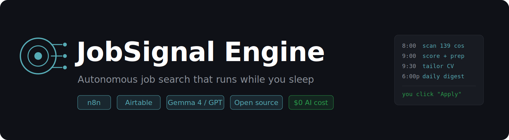
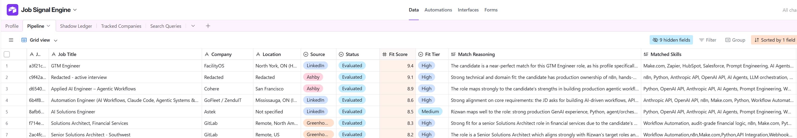
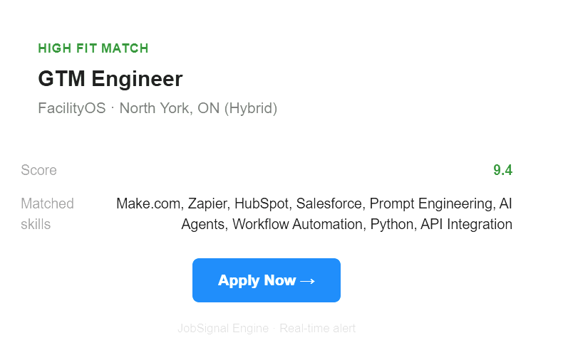
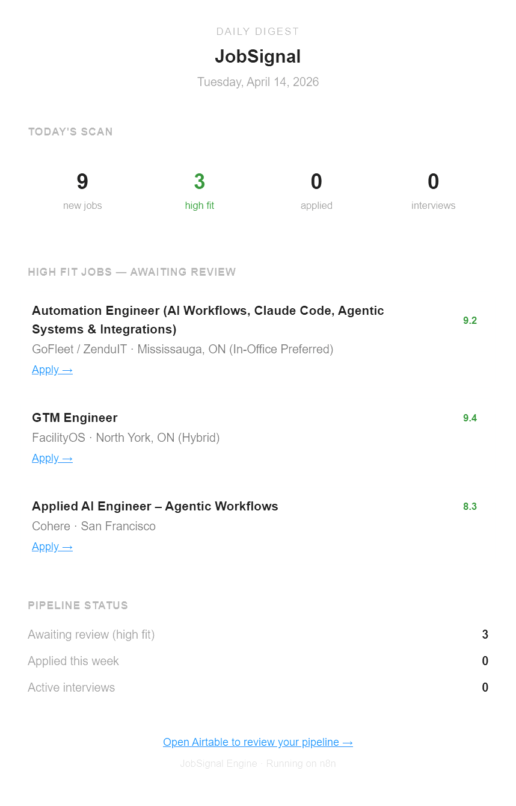
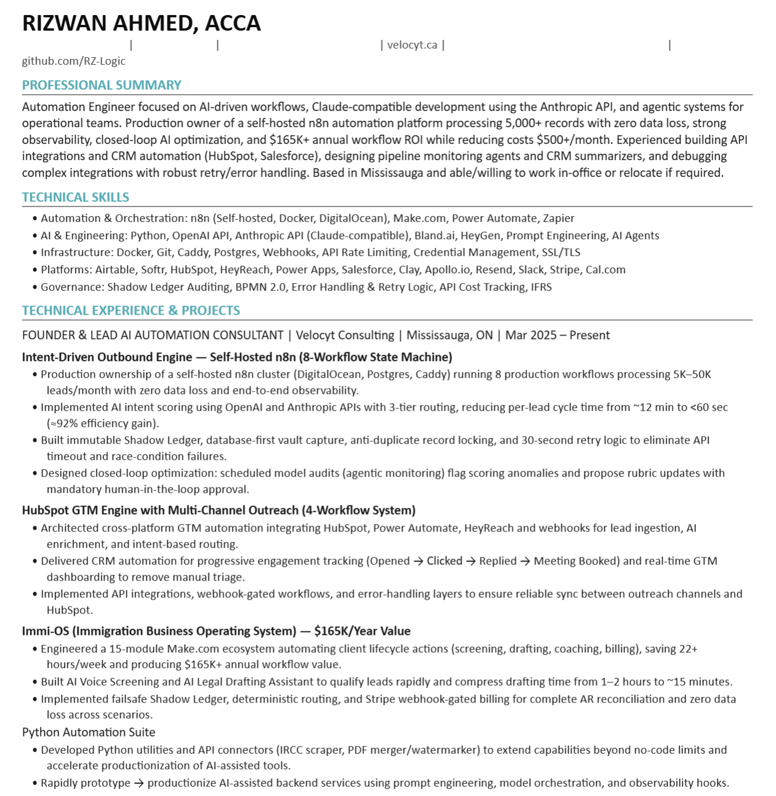
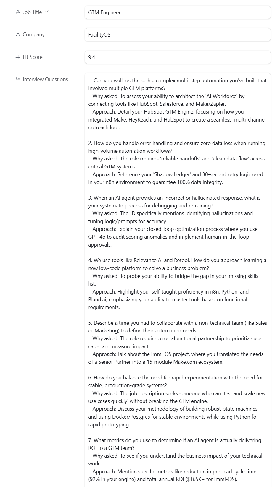
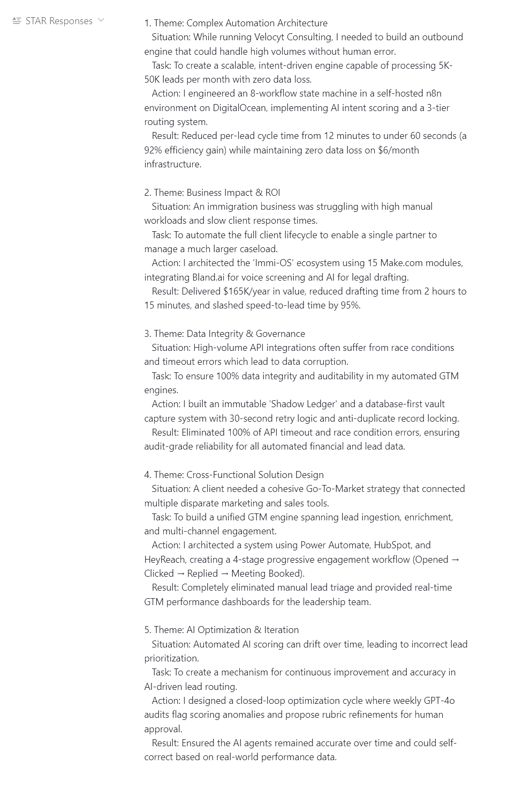
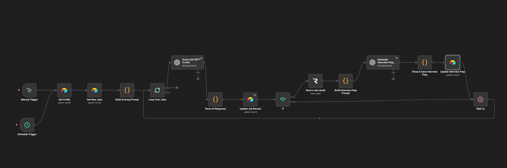

<p align="center">
  
</p>

<h1 align="center">JobSignal Engine</h1>

<p align="center">
  <strong>JobSignal treats your job search like a sales pipeline — it finds roles, scores them, tailors your CV, and preps your interview answers before you wake up. You just review and apply.</strong>
</p>

<p align="center">
  <a href="#-quickstart"></a>
  <a href="https://opensource.org/licenses/MIT"></a>
  <a href="https://n8n.io"></a>
  <a href="https://airtable.com"></a>
  
</p>

<p align="center">
  <a href="#-the-problem">The Problem</a> •
  <a href="#-what-jobsignal-does">What It Does</a> •
  <a href="#-one-jobs-journey">One Job's Journey</a> •
  <a href="#%EF%B8%8F-gotchas--lessons-learned">Gotchas</a> •
  <a href="#-how-jobsignal-compares">Comparison</a> •
  <a href="#-architecture">Architecture</a> •
  <a href="#-ai-providers">AI Providers</a> •
  <a href="#-cost">Cost</a> •
  <a href="#-quickstart">Quickstart</a> •
  <a href="#-screenshots">Screenshots</a>
</p>

---

> **Companies use AI to filter you out. JobSignal gives you AI to filter them first — autonomously, 24/7, for $0–5/month.**

---

```
┌──────────────────────────────────────────────────────────────────┐
│                                                                  │
│   Input:  Your resume (markdown) + preferences (Airtable)        │
│                                                                  │
│   Output (daily, automatic):                                     │
│   ├── Ranked jobs scored 1-10 against YOUR profile               │
│   ├── Tailored CV (DOCX) per High Fit job                        │
│   ├── 15 interview questions + 5 STAR responses per High Fit     │
│   ├── Email alerts for top matches                               │
│   └── Evening digest with full pipeline status                   │
│                                                                  │
│   You do nothing. It runs unattended while you sleep.            │
│                                                                  │
└──────────────────────────────────────────────────────────────────┘
```

---

## 🧑 Why I Built This

I'm an automation architect. I run self-hosted n8n in production for real clients — including a 15-module AI automation ecosystem for a Canadian immigration law firm that saves the team significant weekly hours on case intake, document prep, and client communication.

When I started my own job search, I looked at what was out there. career-ops is the most interesting open-source tool in the space, but it runs interactively from your terminal and — in my experience — burns through a $20/month Claude Pro plan fast on a full search. I wanted something different: a pipeline that runs on a schedule, unattended, finds roles, scores them, preps everything, and emails me the results before I open my laptop.

So I built one the way I build client systems. $0–5/month, fully autonomous, open source, MIT licensed.

---

## 🎯 Does It Actually Work?

I use this for my own job search. In April 2026 — right before this repo went public — JobSignal flagged a Senior AI Agents role at a major crypto exchange. It scored the role 9.1 against my profile, generated my interview prep, and tailored my CV. Comp range: $130K–$260K USD, fully remote.

I applied. I'm currently in interview process for it.

That's the system working on its creator, in production, on a real high-compensation role. Not a demo. Not a synthetic test. An actual interview I'm preparing for right now.

**On verification:** I'm not naming the company while the interview process is active — that's respect for the recruiter, not secrecy. I'm not posting private recruiter emails, period. The Airtable record has a scan timestamp from before this repo went public. If anyone wants to see the evaluation reasoning with company name redacted, open an issue and I'll share it.

*(Updates to come once the process concludes — offer, rejection, or anything in between.)*

---

## 🎯 Who This Is For

- Engineers, automation specialists, solutions architects, PMs, and technical operators actively job hunting
- People who refuse to spray-and-pray with auto-appliers that get your accounts flagged
- Builders willing to invest 30-60 minutes of setup to save hours every week
- Anyone who wants a structured pipeline instead of a messy spreadsheet and midnight LinkedIn scrolling

**Not for you if:** You want one-click magic with zero setup — JobSignal requires an Airtable account, an n8n instance, and an AI provider. Also not ideal for non-technical roles (marketing, sales, creative) without customizing the scoring prompts — the default logic is tuned for technical profiles. If you can follow a setup guide, you'll be running in 30 minutes.

---

## 💀 The Problem

Every job search tool in 2026 falls into one of two traps.

**Trap 1: Spray and Pray.** LoopCV, LazyApply, Sonara, ApplyPilot. They auto-apply to hundreds of jobs. Your name lands on every recruiter's "mass applicant" list, your accounts get flagged, and you get a 1-2% response rate on untargeted applications. Quantity without quality.

**Trap 2: Manual with AI polish.** Teal, Careerflow, career-ops. They help you write better resumes and evaluate individual jobs, but discovery and pipeline management are still manual. You're still scrolling LinkedIn at midnight hoping the algorithm surfaces something relevant.

| Tool | Discovers jobs for you? | Runs unattended? | Monthly cost | AI cost |
|------|:-:|:-:|---:|---:|
| LoopCV | ❌ | ❌ | $49-149 | Included |
| LazyApply | ❌ | ❌ | $99 | Included |
| Teal | ❌ | ❌ | $9-44 | Included |
| career-ops | ✅ (manual trigger) | ❌ | Free | $20 (Claude Pro) |
| **JobSignal** | **✅ (scheduled)** | **✅** | **$0-6** | **$0** |

**What nobody has built:** A signal-based job search engine that treats your job hunt like a sales pipeline — with autonomous multi-source discovery, structured AI scoring, auto-tailored CVs, interview prep, pipeline management, and daily email digests. All running unattended on a schedule while you sleep.

That's JobSignal.

---

## ⚡ What JobSignal Does

Scans 139 verified companies daily — including Anthropic, OpenAI, Vercel, Stripe, Cohere, ElevenLabs, Perplexity, Linear, Airtable, n8n, LangChain, Runway, Replit, and [126 more](companies-default.csv).

```
Every morning at 8am, while you're still asleep:

  8:00  →  Scanners check 139 company career pages for new jobs
  8:05  →  Greenhouse, Ashby, and Lever APIs return open roles
  8:10  →  Deduplication removes jobs you've already seen
  9:00  →  AI scores every new job against YOUR profile (1-10)
  9:00  →  High Fit? → EMAIL ALERT + 15 interview questions + 5 STAR responses
  9:30  →  AI TAILORS YOUR CV for each High Fit job → DOCX attached in Airtable
  6:00pm → DAILY DIGEST EMAIL: what was found, what scored high, pipeline status

Sunday midnight:
  →  Auto-archives stale Low Fit jobs
  →  Auto-closes applications with no response after 30 days
  →  Alerts you if any jobs are stuck in "New" for 3+ days

You wake up to an email with your top matches, tailored CVs ready,
interview prep done. You just click "Apply."
```

By 9:30 AM, every new relevant job is scored, prepped, and has a tailored CV attached to its Airtable record.

### Feature Overview

| Feature | What it does | Works on Cloud? |
|---------|-------------|:-:|
| **Multi-source scanning** | Checks Greenhouse, Ashby, Lever APIs across 139+ companies daily | ✅ |
| **LinkedIn + Indeed scanning** | Scrapes LinkedIn and Indeed via JobSpy sidecar | Self-hosted only |
| **AI fit scoring** | Scores every job 1-10 against your profile with detailed reasoning | ✅ |
| **Interview prep** | 15 tailored questions + 5 STAR responses per High Fit job | ✅ |
| **CV tailoring** | AI rewrites your CV per job description → DOCX file | ✅ |
| **High Fit email alerts** | Instant email when a 8+ score job is found | ✅ |
| **Daily digest** | Evening summary: new jobs, high fits, pipeline stats | ✅ |
| **Auto-housekeeping** | Archives stale jobs, closes ghosted applications weekly | ✅ |
| **Bring your own AI** | GPT-5 mini, Gemma 4 (free), LM Studio, Ollama, OpenRouter — one credential swap | ✅ |
| **Dynamic geography** | Filter by country/region from your Profile — no code changes | ✅ |
| **Cost tracking** | Every AI call logs its exact token cost | ✅ |

---

## 🔍 One Job's Journey

A single job listing flowing through the complete system:

**8:00 AM — Discovery.** The Greenhouse Scanner fires. It hits Linear's careers API, finds 12 open roles. The Parse & Filter node checks each title against your keywords ("automation," "engineer," "architect") and location against your geography ("Canada," "Remote Global"). 3 jobs pass. Deduplication checks them against your Pipeline — 2 are new. They enter Airtable with Status: **New**.

**9:00 AM — Evaluation.** The Evaluator picks up both jobs. It builds a scoring prompt that injects your full profile — skills, target roles, industries, negative filters, seniority level — and sends each job + your profile to the AI. Job #1 (AI Automation Engineer, Linear, Remote) scores **9.2 — High Fit**. Job #2 (Data Entry Clerk, Linear, Ottawa) scores **1.8 — Low Fit**. Both are updated in Airtable with scores, reasoning, matched/missing skills, and CV tailoring notes.

**9:00 AM — Alert.** Job #1 scored High. An email fires immediately: job title, company, score, matched skills, and a direct "Apply Now" link. You see it on your phone over coffee.

**9:01 AM — Interview Prep.** Still inside the Evaluator loop, the AI generates 15 interview questions (behavioral, technical, situational, culture fit) tailored to the specific JD + your profile. Then 5 STAR responses referencing your real projects. Saved to Airtable.

**9:30 AM — CV Tailoring.** The Tailor workflow polls for High Fit jobs without a tailored CV. It finds Job #1, sends your CV markdown + the JD + the Evaluator's tailoring notes to the AI. The AI rewrites your summary, reorders skills to match the JD, adjusts project descriptions to emphasize relevant experience. A Python sidecar converts the markdown to a polished DOCX. The file is uploaded directly to the Airtable record as an attachment.

**6:00 PM — Daily Digest.** The Alerter sends your evening email: "2 new jobs today. 1 High Fit. 0 awaiting review. 3 applied this week." With a card for the Linear role showing score, skills, and the apply link.

**Sunday Midnight — Housekeeping.** Job #2 (Low Fit, 1.8) has been sitting in Evaluated for 7 days. The Housekeeper archives it. An application you submitted 31 days ago with no response? Auto-closed with a note: "No response after 30 days." Your pipeline stays clean.

**You did nothing.** The system found the job, scored it, prepped your interview, tailored your CV, and told you about it. You review, hit apply, move on.

---

## ⚠️ Gotchas & Lessons Learned

Hard-won knowledge from building and running JobSignal in production. Save yourself the debugging:

- **Airtable free tier caps at 1,000 records per base.** Dedicate a separate workspace to JobSignal or writes will silently fail. The Housekeeper's weekly auto-archive keeps the count manageable.
- **`require('crypto')` is blocked in n8n Code nodes.** JobSignal uses a pure-JS FNV-1a hash for job deduplication instead of SHA-256.
- **Greenhouse slug guessing has a ~60% failure rate.** Many tech companies have migrated to Ashby. Always verify API endpoints before adding to Tracked Companies — a `{"jobs":[],"total":0}` response means the endpoint works, just no matching jobs.
- **Airtable multi-select fields reject unknown values.** AI-generated skill lists will fail if the values don't already exist as options. JobSignal uses long text fields for Matched/Missing Skills to avoid this.
- **DigitalOcean blocks SMTP ports (465, 587) by default.** Use Resend (HTTP API) instead, or open a support ticket to unblock SMTP.
- **n8n's "Output Content as JSON" toggle doesn't work with all providers.** For Gemma 4 and other open-source models, turn it off and enforce JSON output via the system prompt instead.
- **Open-source models wrap responses in `<thought>` tags.** The Parse nodes include stripping logic to handle this — extracting clean JSON or CV content from thinking preamble.
- **n8n parallel fan-out into a single Code node causes "node hasn't been executed" errors.** Chain Airtable queries sequentially, not in parallel. The Housekeeper learned this the hard way.

---

## 🆚 How JobSignal Compares

Think of career-ops as a sports car you drive from the terminal. JobSignal is a self-driving car that runs on a schedule and emails you the keys.

| | JobSignal | career-ops | LoopCV | LazyApply | Teal |
|---|---|---|---|---|---|
| **What it is** | Autonomous pipeline | CLI tool | Auto-applier | Auto-applier | Resume builder |
| **Discovers jobs** | ✅ Scheduled, unattended | ✅ Manual CLI trigger | ❌ | ❌ | ❌ |
| **Runs while you sleep** | ✅ | ❌ Needs active terminal | ❌ | ❌ | ❌ |
| **AI scoring** | ✅ 1-10 with reasoning | ✅ A-F grading | ❌ | ❌ | ❌ |
| **Interview prep** | ✅ 15 Q + 5 STAR per job | ✅ STAR stories | ❌ | ❌ | ❌ |
| **CV tailoring** | ✅ DOCX per job | ✅ PDF per job | ❌ | ❌ | ✅ Basic |
| **Pipeline tracking** | ✅ Full lifecycle | ✅ TSV files | ❌ | ❌ | ✅ Basic |
| **Email alerts** | ✅ Real-time + daily digest | ❌ | ❌ | ❌ | ❌ |
| **Auto-housekeeping** | ✅ Weekly cleanup | ❌ | ❌ | ❌ | ❌ |
| **Bring your own AI** | ✅ Any OpenAI-compatible | ❌ Claude only | ❌ | ❌ | ❌ |
| **Blasts low-quality applications** | ❌ By design | ❌ | ✅ | ✅ | ❌ |
| **Self-hostable** | ✅ | ✅ | ❌ | ❌ | ❌ |
| **Open source** | ✅ MIT | ✅ MIT | ❌ | ❌ | ❌ |
| **Monthly cost** | $0-6 | Free (+ $20 Claude Pro) | $49-149 | $99 | $9-44 |
| **AI cost** | $0 (Gemma 4) | ~$20 (Claude Pro) | Included | Included | Included |

---

## 🏗️ Architecture

JobSignal is 8 workflows + a shared database. No microservices, no Kubernetes, no over-engineering.

```
┌─────────────────────────────────────────────────────────────────────┐
│                        AIRTABLE (Source of Truth)                    │
│                                                                     │
│  ┌──────────┐ ┌──────────────┐ ┌──────────┐ ┌───────────────────┐  │
│  │ Profile  │ │   Tracked    │ │ Pipeline │ │  Search Queries   │  │
│  │ (1 row)  │ │  Companies   │ │ (grows)  │ │  (JobSpy config)  │  │
│  │          │ │  (139 cos)   │ │          │ │                   │  │
│  └──────────┘ └──────────────┘ └──────────┘ └───────────────────┘  │
└──────────────────────────┬──────────────────────────────────────────┘
                           │
        ┌──────────────────┼──────────────────┐
        │                  │                  │
        ▼                  ▼                  ▼
┌──────────────┐  ┌──────────────┐  ┌──────────────┐
│  Wf 1a: Scan │  │  Wf 1b: Scan │  │  Wf 1c: Scan │    ← 8:00-8:10 AM
│  Greenhouse  │  │    Ashby     │  │    Lever     │
│  (HTTP API)  │  │  (HTTP API)  │  │  (HTTP API)  │
└──────┬───────┘  └──────┬───────┘  └──────┬───────┘
       │                 │                 │
       ▼                 ▼                 ▼
       └────────► PIPELINE TABLE ◄─────────┘
                    (New jobs)
                        │
                        ▼
              ┌──────────────────┐
              │   Wf 2: Evaluate │              ← 9:00 AM
              │                  │
              │  Score 1-10      │
              │  Fit Tier        │──── High Fit? ──► Email Alert
              │  Match Reasoning │                   + Interview Prep
              │  Tailoring Notes │                   (15 Q + 5 STAR)
              └────────┬─────────┘
                       │
                       ▼
              ┌──────────────────┐
              │   Wf 3: Tailor   │              ← 9:30 AM
              │                  │
              │  AI rewrites CV  │
              │  Python → DOCX   │
              │  Upload to       │
              │  Airtable        │
              └────────┬─────────┘
                       │
                       ▼
              ┌──────────────────┐
              │   Wf 4: Housekeep│              ← Sunday midnight
              │                  │
              │  Archive stale   │
              │  Close ghosted   │
              │  Alert stuck     │
              └────────┬─────────┘
                       │
                       ▼
              ┌──────────────────┐
              │   Wf 6: Alerter  │              ← 6:00 PM
              │                  │
              │  Daily digest    │
              │  email with      │
              │  pipeline stats  │
              └──────────────────┘
```

### Self-Hosted Bonus: JobSpy Scanner

If you self-host n8n or run n8n Desktop, Workflow 1d adds LinkedIn and Indeed scanning via a Python sidecar. Same pipeline, more sources.

```
┌──────────────────┐
│  Wf 1d: Scan     │    ← Self-hosted only
│  JobSpy Sidecar  │
│                  │
│  LinkedIn        │
│  Indeed          │───► PIPELINE TABLE
│  (Python Flask)  │
└──────────────────┘
```
---

###  🔧 Tech Stack

| Layer | Technology |
|-------|-----------|
| Orchestration | n8n (self-hosted, Cloud, or Desktop) |
| Database | Airtable |
| AI | Gemma 4, GPT-5 mini, or any OpenAI-compatible model |
| CV Rendering | Python + python-docx (Docker sidecar) |
| Job Scraping | JobSpy + Flask (Docker sidecar) |
| Reverse Proxy | Caddy |
| Persistence | PostgreSQL |
| Notifications | Gmail SMTP / Resend / Discord |

---

### 📋 Workflow Reference

| Workflow | Purpose | Schedule | Key Details |
|----------|---------|----------|-------------|
| **1a — Greenhouse** | Scan Greenhouse API career pages | Daily 8:00 AM | 139 verified companies, free public JSON API |
| **1b — Ashby** | Scan Ashby API career pages | Daily 8:05 AM | Covers OpenAI, Perplexity, Runway, LangChain, Replit |
| **1c — Lever** | Scan Lever API career pages | Daily 8:10 AM | Thinner coverage — Mistral, Plaid confirmed |
| **1d — JobSpy** | LinkedIn + Indeed scraping | Daily 8:15 AM | Self-hosted & Desktop only. Python sidecar on port 3457 |
| **2 — Evaluator** | AI scoring + interview prep + alerts | Daily 9:00 AM | Scores 1-10, generates interview prep for High Fit |
| **3 — Tailor** | AI CV tailoring + DOCX generation | Daily 9:30 AM | Python sidecar on port 3456 for DOCX rendering |
| **4 — Housekeeper** | Auto-archive + auto-close + alerts | Sunday midnight | Archives Low Fit >7d, closes no-response >30d |
| **5 — Optimizer** | Closed-loop scoring analytics | *v1.1 — see [Roadmap](#-roadmap)* | Reserved. Learns from interview outcomes to refine scoring |
| **6 — Alerter** | Daily digest email | Daily 6:00 PM | Pipeline summary + High Fit job cards |

---

## 🧠 AI Providers — Bring Your Own Model

The entire AI layer is a single n8n OpenAI credential. Every provider implements the same OpenAI-compatible API. Pick one, set the Base URL and API key, every workflow uses it. Zero workflow changes.

| Tier | Provider | Model | Base URL | API Key | AI Cost |
|------|----------|-------|----------|---------|---------|
| **Free (cloud)** | Google AI Studio | Gemma 4 26B | `https://generativelanguage.googleapis.com/v1beta/openai` | Free at [aistudio.google.com/apikey](https://aistudio.google.com/apikey) | **$0/month** |
| **Free (local)** | LM Studio | Qwen 3 8B, Llama 3.2 | `http://localhost:1234/v1` | `not-needed` | **$0/month** |
| **Free (local, CLI)** | Ollama | Same models | `http://localhost:11434/v1` | (leave empty) | **$0/month** |
| **Budget (cloud)** | OpenAI | GPT-5 mini | `https://api.openai.com/v1` | Your API key | **~$3-5/month** |
| **Flexible (cloud)** | OpenRouter | 300+ models | `https://openrouter.ai/api/v1` | Your API key | **Varies** |

### How to Switch

In n8n: **Credentials → OpenAI API → set Base URL and API Key.** Done. Every workflow inherits it.

### Google AI Studio (Recommended Free Tier)

Gemma 4 via Google AI Studio is free, fast, and has been validated against all three JobSignal AI workflows (evaluation, interview prep, CV tailoring). Rate limits: 15 requests/minute, 1,500 requests/day — enough to evaluate 750+ jobs daily (as of April 2026 — [verify current limits](https://aistudio.google.com/apikey)).

**Setup:** Get a free API key at [aistudio.google.com/apikey](https://aistudio.google.com/apikey) (no credit card), set the model to `gemma-4-26b-a4b-it` in each AI node, and turn **off** the "Output Content as JSON" toggle.

### LM Studio (Recommended for Zero Cloud Dependency)

Download [LM Studio](https://lmstudio.ai), click Discover, download a model (Qwen 3 8B works well), go to Developer tab, click Start Server. You now have an AI API at `localhost:1234`. No API keys, no internet, no monthly bills.

**Requirements:** 16GB RAM minimum. Apple Silicon Macs are especially good — Metal acceleration is automatic.

**Note:** LM Studio/Ollama only work with n8n Desktop or self-hosted n8n on the same machine. n8n Cloud can't reach localhost.

---

## 📊 Cost

### Self-Hosted (Full Power)

| Component | With Free AI | With GPT-5 mini |
|-----------|-----------|-------------|
| DigitalOcean droplet (1GB) | $6 | $6 |
| AI (Google AI Studio / LM Studio) | $0 | — |
| AI (OpenAI GPT-5 mini) | — | ~$3-5 |
| Airtable (free, 1,000 records) | $0 | $0 |
| Job scanning (Greenhouse/Ashby/Lever APIs) | $0 | $0 |
| JobSpy (LinkedIn + Indeed) | $0 | $0 |
| Email notifications (Gmail SMTP) | $0 | $0 |
| **Total** | **$6/month** | **~$9-11/month** |

### n8n Cloud (No Infrastructure)

| Component | With Free AI | With GPT-5 mini |
|-----------|-----------|-------------|
| n8n Cloud Starter | $24 | $24 |
| AI (Google AI Studio) | $0 | — |
| AI (OpenAI GPT-5 mini) | — | ~$3-5 |
| Airtable | $0 | $0 |
| Job scanning (Greenhouse/Ashby/Lever APIs) | $0 | $0 |
| **Total** | **$24/month** | **~$27-29/month** |

### Fully Local (Zero Cost)

| Component | Cost |
|-----------|------|
| n8n Desktop (free) | $0 |
| LM Studio + Gemma 4 / Qwen 3 | $0 |
| Airtable (free) | $0 |
| Greenhouse/Ashby/Lever APIs | $0 |
| **Total** | **$0/month** |

### Per-Job Cost Breakdown

| Action | GPT-5 mini | Gemma 4 (free) |
|--------|-----------|----------------|
| Job evaluation | ~$0.003 | $0 |
| Interview prep (High Fit only) | ~$0.015 | $0 |
| CV tailoring (High Fit only) | ~$0.010 | $0 |
| **Total per High Fit job** | **~$0.02** | **$0** |
| **Total per Low/Medium job** | **~$0.003** | **$0** |

At 30 new jobs/day with 3 High Fits, that's ~$0.15/day or **~$3-5/month** on GPT-5 mini. Or $0 on Gemma 4.

---

## 🚀 Quickstart

### Prerequisites

- An [Airtable](https://airtable.com) account (free tier works)
- An [n8n](https://n8n.io) instance (self-hosted, Cloud, or Desktop)
- An AI provider API key (or use Google AI Studio for free)

### 1. Set Up Airtable (10 minutes)

Import the CSV templates from the [`airtable/templates/`](airtable/templates/) folder. This creates 4 tables:

| Table | Purpose | You need to fill in |
|-------|---------|-------------------|
| **Profile** | Your skills, target roles, geography, CV | Everything — this drives all AI prompts |
| **Tracked Companies** | Companies to scan daily | Pre-loaded with 139 verified companies |
| **Pipeline** | Every discovered job (auto-populated) | Nothing — workflows fill this |
| **Search Queries** | JobSpy search config (self-hosted only) | Only if using JobSpy |

See [`AIRTABLE-SCHEMA.md`](airtable/AIRTABLE-SCHEMA.md) for every field and sample values.

### 2. Import Workflows into n8n (5 minutes)

Download the JSON files from [`workflows/`](workflows/) and import them into n8n:

```
Settings → Import from File → select each JSON file
```

Import in this order:
1. `01a-scanner-greenhouse.json`
2. `01b-scanner-ashby.json`
3. `01c-scanner-lever.json`
4. `02-evaluator.json`
5. `03-tailor.json`
6. `04-housekeeper.json`
7. `06-alerter.json`

### 3. Set Up Credentials (5 minutes)

You need 2 credentials in n8n:

| Credential | Type | What to set |
|------------|------|-------------|
| **Airtable** | Airtable Personal Access Token | Your Airtable PAT with read/write access to the base |
| **AI Provider** | OpenAI API | Base URL + API key from the [AI Providers table](#-ai-providers--bring-your-own-model) |

For email notifications, add one of:
- **Gmail** — App password + Send Email node (recommended for most users)
- **Resend** — HTTP API, free 100 emails/day (recommended for DigitalOcean, which blocks SMTP)

### 4. Configure Your Profile (10 minutes)

Open the **Profile** table in Airtable and fill in one row:

- **Professional Summary** — 2-3 sentences describing your positioning
- **Core Skills** — your primary technical skills
- **Target Roles** — job titles you're pursuing
- **Target Industries** — preferred industries
- **Negative Filters** — hard exclusions (Junior, PHP, Blockchain, etc.)
- **Target Geography** — countries/regions (Canada, Remote Global, etc.)
- **CV Markdown** — your full CV in markdown format (critical for tailored CVs and STAR responses)
- **Notification Email** — where alerts go

### 5. Activate and Run (1 minute)

Toggle each workflow to **Active**. They'll run on their configured schedules automatically.

Or trigger any workflow manually to test: click the **Execute Workflow** button in n8n.

---

## 📸 Screenshots

### Airtable Pipeline — Your Job Search Dashboard
<p align="center">
  
</p>

### High Fit Email Alert — Instant Notification
<p align="center">
  
</p>

### Daily Digest — Evening Pipeline Summary
<p align="center">
  
</p>

### AI-Tailored CV — DOCX Output
<p align="center">
  
</p>

### Interview Prep — 15 Questions + 5 STAR Responses
<p align="center">
  
  
</p>

### n8n Evaluator Workflow — Under the Hood
<p align="center">
  
</p>

---

## 📂 Repository Structure

```
jobsignal-engine/
├── README.md
├── LICENSE                          # MIT
├── companies-default.csv            # 139 verified companies, 30 categories
├── docker-compose.example.yml       # Full stack example (see SETUP.md)
├── workflows/
│   ├── 01a-scanner-greenhouse.json
│   ├── 01b-scanner-ashby.json
│   ├── 01c-scanner-lever.json
│   ├── 01d-scanner-jobspy.json      # Self-hosted only
│   ├── 02-evaluator.json
│   ├── 03-tailor.json
│   ├── 04-housekeeper.json
│   └── 06-alerter.json
├── scripts/
│   ├── cv_service.py                # CV renderer Flask sidecar (self-hosted)
│   ├── render_cv.py                 # python-docx CV generation
│   ├── jobspy_service.py            # JobSpy Flask sidecar (self-hosted)
│   ├── Dockerfile.cv-renderer
│   ├── Dockerfile.jobspy
│   └── requirements.txt
├── airtable/
│   ├── AIRTABLE-SCHEMA.md
│   └── templates/                   # CSV templates for each table
├── docs/
│   ├── SETUP.md                     # Full setup guide (self-hosted + cloud)
│   ├── CUSTOMIZATION.md             # Adding companies, tuning keywords
│   ├── AI-PROVIDERS.md              # Detailed AI tier configuration
│   ├── NOTIFICATION-SETUP.md        # Gmail, Resend, Discord setup
│   └── COST-GUIDE.md                # Detailed cost breakdowns
└── assets/
    └── *.png                        # Screenshots and diagrams
```

---

## 🛡️ Design Principles

| Principle | How it works |
|-----------|-------------|
| **No auto-apply, by design** | JobSignal never submits applications for you. It finds, scores, and preps — you decide where your name goes. |
| **Zero data loss** | Every Airtable write uses retry logic (3 attempts, 5s intervals). No job is ever silently dropped. |
| **Anti-duplicate** | FNV-1a hash of title + company + apply link. Same job from multiple sources = one Pipeline record. |
| **Safety brakes** | Scanner loops cap at 100-200 jobs per run. Prevents runaway API calls on misconfigured queries. |
| **Graceful degradation** | CV generation failure never blocks job scoring. Notification failure never blocks job processing. |
| **Cost transparency** | Every AI call logs exact token cost. $0 for free-tier models. |
| **Multi-source resilience** | If LinkedIn rate-limits, Indeed and Greenhouse still run. No single point of failure. |
| **Provider-agnostic AI** | Same workflow, any model. Switch providers by changing one credential. |

---

## 🫡 Honest Limitations

I built this because I use it daily. That doesn't mean it's magic. Things you should know before committing 30 minutes of setup:

- **Scoring quality depends on your Profile.** Garbage in, garbage out. A thin Profile with vague Target Roles will score every job a 6. A sharp Profile with specific skills, industries, negative filters, and a real CV markdown will score jobs accurately. Budget 20 minutes on the Profile — it's the single highest-leverage thing in the whole system.
- **Default scoring is tuned for technical roles.** The evaluation prompt assumes you're pursuing engineering, automation, architecture, PM, or technical operator work. For marketing, sales, creative, or legal, you'll want to tune the scoring prompt in Workflow 2. It's ~50 lines of plain English.
- **LinkedIn scraping is fragile by nature.** JobSpy depends on LinkedIn's public HTML, which LinkedIn occasionally changes to break scrapers. When it breaks, it breaks for everyone on JobSpy at once. Greenhouse/Ashby/Lever API scanners are unaffected — they're on stable public JSON APIs.
- **Gemma 4 free tier is rate-limited to 1,500 requests/day.** That's enough for 750+ job evaluations, but if you run a huge keyword net (20+ title keywords × 100+ companies) you can hit the ceiling. Fall back to GPT-5 mini (~$3–5/month) when that happens.
- **n8n Cloud can't run the sidecars.** If you go with n8n Cloud for convenience, you lose JobSpy (LinkedIn/Indeed) and DOCX CV generation. You still get everything else. The full-power setup needs a $6 VPS.
- **Greenhouse slug discovery is imperfect.** About 40% of companies you add manually will work the first try; the rest need a verified slug. `companies-default.csv` ships with 139 already verified so you can start fast.
- **This is not an applicant tracking system for recruiters.** It's a personal pipeline for one job seeker. Multi-user, team, or agency use cases need a different tool.

---

## 🛠️ Self-Hosted Setup (Full Power)

For users who want LinkedIn + Indeed scanning and DOCX CV generation:

### Docker Compose (recommended)

A complete [`docker-compose.example.yml`](docker-compose.example.yml) is included in the repo. It wires together n8n, Postgres, Caddy, and both sidecars. See [`SETUP.md`](docs/SETUP.md) for the full walkthrough.

The key sidecar services:

```yaml
cv-renderer:
  build:
    context: .
    dockerfile: scripts/Dockerfile.cv-renderer
  restart: always
  expose:
    - "3456"

jobspy-scanner:
  build:
    context: .
    dockerfile: scripts/Dockerfile.jobspy
  restart: always
  expose:
    - "3457"
```

**Hardware note:** Running both sidecars simultaneously requires 2GB+ RAM on your VPS. On a 1GB droplet, run one at a time or upgrade.

### Deployment Modes

| Feature | Self-Hosted | n8n Cloud | Fully Local |
|---------|:-:|:-:|:-:|
| Greenhouse/Ashby/Lever scanning | ✅ | ✅ | ✅ |
| LinkedIn + Indeed (JobSpy) | ✅ | ❌ | ✅ |
| AI scoring (cloud APIs) | ✅ | ✅ | ❌ |
| AI scoring (local LM Studio/Ollama) | ✅ | ❌ | ✅ |
| Tailored CV as DOCX | ✅ | ❌ (text only) | ✅ |
| 24/7 automated scheduling | ✅ | ✅ | ❌ (on when laptop is on) |
| Email notifications | ✅ | ✅ | ✅ |

---

## 🗺️ Roadmap

- [ ] **Workflow 5 — Optimizer** — Closed-loop analytics that learns from interview callbacks and rejections to refine scoring over time (v1.1, needs outcome data)
- [ ] **Shadow Ledger** — Immutable JSONL audit trail logged alongside Airtable writes. Same pattern I use in other production systems — every workflow run appends a signed record to disk so you can replay, debug, or audit any action the system ever took. (v1.1)
- [ ] **Story Bank** — Cumulative STAR story database that grows across all evaluated jobs
- [ ] **Minimum salary filter** — Skip jobs below your floor before AI evaluation
- [ ] **Negative title filter** — Profile-level exclusions for country-in-title postings
- [ ] **Application auto-fill** — Playwright-based form filling for Greenhouse/Lever/Ashby
- [ ] **NocoDB backend** — Open-source Airtable alternative with migration script

---

## 🤝 Contributing

JobSignal is 8 n8n workflow JSON files + 3 Python scripts. You can understand the entire system in an afternoon.

```bash
git clone https://github.com/RZ-Logic/jobsignal-engine.git
cd jobsignal-engine
# Import workflows into n8n, set up Airtable, start building
```

**Great first contributions:**
- Add companies to `companies-default.csv` with verified API endpoints
- Test and document new AI providers (Mistral, DeepSeek, Qwen via OpenRouter)
- Build notification integrations (Telegram, Slack, Discord webhooks)
- Write setup guides for additional VPS providers
- Translate docs to other languages

---

## 📜 License

MIT — do whatever you want with it.

---

## 💬 Need Help Deploying This?

If you want help setting up JobSignal on your own stack or customizing it for your profile and target roles:

- Website: [velocyt.ca](https://velocyt.ca)
- GitHub: [RZ-Logic](https://github.com/RZ-Logic)

Also built: [Autonomous GTM Engine](https://github.com/RZ-Logic/autonomous-gtm-engine) • [GPU Deals Canada](https://github.com/RZ-Logic/gpu-price-alert-bot)

---

<p align="center">
  <strong>If JobSignal saved you 10+ hours of job searching, star the repo ⭐</strong>
  <br><br>
  Built in Toronto by someone who got tired of scrolling LinkedIn at midnight.
</p>
